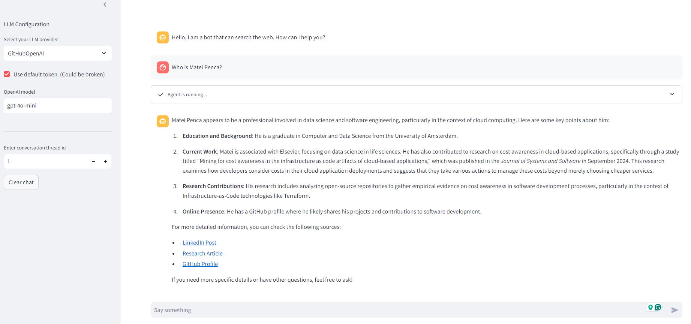

# AI Search Engine - Agentic RAG System with Web Search Integration'

## 🔥 Hosted version available 🔥

You can try the latest version of this repository for free at the following link:
https://docker-web-llm-agent-345492506871.europe-west4.run.app/

## Overview

This project is a **Generative AI (GenAI) application** that leverages **LangGraph** to build an agent-driven Retrieval-Augmented Generation (RAG) system. The application integrates an open-source web search engine to search for real-time information to answer user queries. 

Key features:
- The AI agent autonomously decides **what** information to search for and **when** to search.
- It retrieves, scrapes, and processes information from the web in real-time.
- Answers are generated **exclusively** from the information it finds, ensuring accurate and source-cited responses.
- The application scrapes individual links for further insights if necessary.

This system aims to enhance search capabilities by making use of advanced language models and real-time web searches, helping users find accurate and up-to-date answers.



---

## Key Components

- **Backend**: 
  - `agent_tools.py`, `web_agent.py`, and `llm_prompts.py` handle core functionalities related to the GenAI agent and web search integration.
  
- **Notebooks**: 
  - Jupyter Notebooks for experimenting with LangGraph and testing various models and integrations.

- **SearXNG**:
  - An open-source search engine framework integrated into the project for performing web searches.
  
- **Streamlit App**:
  - `Streamlit_app.py` serves as the front-end interface for the project, allowing users to interact with the agent.

---

## How It Works

1. **User Query**: The user inputs a question through the application interface (powered by Streamlit).
2. **Web Search**: The agent performs a web search via SearXNG and scrapes relevant links.
3. **Autonomous Processing**: The agent autonomously decides when additional information is needed, scraping and retrieving more content as necessary.
4. **Response Generation**: The AI generates a response solely based on the information found, ensuring each answer is accurate and cites its sources.
   
---

## Installation & Setup

### Main Streamlit Application

1. **Clone the repository**:
    ```bash
    git clone https://github.com/your-repo-url.git
    cd ai-search-engine
    ```

2. **Install dependencies**:
    ```bash
    pip install -r requirements.txt
    ```

3. **Set up environment variables**:
    - Create a `.env` file from the example provided:
      ```bash
      cp env_example .env
      ```

4. **Run the Streamlit App**:
    ```bash
    streamlit run Streamlit_app.py
    ```

5. **Optional - Docker Setup**:
    - Build and run the Docker container using `docker-compose`:
      ```bash
      docker-compose up --build
      ```

### Searx Search Engine

Simplest way is to set it up using the Docker setup:
1. Navigate to right directory
    ```bash
      cd searxng
      ```
2. Build and run the Docker container using `docker-compose`
    ```bash
      docker-compose up --build
      ```

---

## Contributing

Feel free to contribute to this project by opening a pull request. For major changes, please open an issue first to discuss what you'd like to change.

---

## License

This project is licensed under the MIT License - see the [LICENSE](LICENSE) file for details.

---

## Acknowledgments

- Thanks to the creators of **LangGraph** and **SearXNG** for their open-source contributions.\
- This project was heavily inspired by the Open-Source work done by the authors of
[Perplexica](https://github.com/ItzCrazyKns/Perplexica) which itself imitates PerplexityAI.
